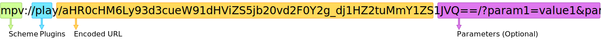

[English][readme-en] | [简体中文][readme-zh-hans] | [繁体中文][readme-zh-hant]

[readme-en]: https://github.com/akiirui/mpv-handler/blob/main/README.md
[readme-zh-hans]: https://github.com/akiirui/mpv-handler/blob/main/README.zh-Hans.md
[readme-zh-hant]: https://github.com/akiirui/mpv-handler/blob/main/README.zh-Hant.md

# mpv handler

A protocol handler for **mpv**, written by Rust.

Use **mpv** and **yt-dlp** to play video and music from the websites.

Please use it with userscript:

[![play-with-mpv][badges-play-with-mpv]][greasyfork-play-with-mpv]

## Protocol



### Plugins

- `play`: Use mpv player to play video

### Encoded URL

Use [URL-safe base64][rfc-base64-url] to encode the URL.

Replace `/` to `_`, `+` to `-` and remove padding `=`.

Example (JavaScript):

```javascript
let data = btoa("https://www.youtube.com/watch?v=Ggkn2f5e-IU");
let safe = data.replace(/\//g, "_").replace(/\+/g, "-").replace(/\=/g, "");
```

### Parameters (Optional)

```
cookies = [ www.domain.com.txt ]
profile = [ default, low-latency, etc... ]
quality = [ best, 2160p, 1440p, 1080p, 720p, 480p, 360p ]
v_codec = [ av01, vp9, h265, h264 ]
subfile = [ Encoded URL ]
```

## Installation

### Linux

- Arch Linux

  [![mpv-handler][badges-aur]][download-aur] \
  [![mpv-handler-git][badges-aur-git]][download-aur-git]

#### Manual installation

1. Download [latest Linux release][download-linux]
2. Unzip the archive
3. Copy `mpv-handler` to `$HOME/.local/bin`
4. Copy `mpv-handler.desktop` to `$HOME/.local/share/applications/`
5. Set executable permission for binary

```
$ chmod +x $HOME/.local/bin/mpv-handler
```

6. Register xdg-mime (thanks for the [linuxuprising][linuxuprising] reminder)

```
$ xdg-mime default mpv-handler.desktop x-scheme-handler/mpv
```

6. Add `$HOME/.local/bin` to your environment variable `PATH` (if needed)
7. Create `$HOME/.config/mpv-handler/config.toml` and edit it (if needed)

### Windows

Windows users need to install manually.

#### Manual installation

1. Download [latest Windows release][download-windows]
2. Unzip the archive to the directory you want
3. Run `handler-install.bat` register protocol handler
4. Add **mpv** and **yt-dlp** to environment variable `PATH` (if needed)
5. Edit `config.toml` (if needed)

### macOS (Alpha)

**I haven't tested it, if it doesn't work, please open an issue.**

macOS users need to install manually

#### Manual installation

1. Download [latest macOS release][download-macos]
2. Unzip the archive and copy `mpv-handler.app` directory to `$HOME/Applications`
3. Add **mpv** and **yt-dlp** to environment variable `PATH` (if needed)
4. Create `$HOME/Library/Application Support/mpv-handler/config.toml` and edit it (if needed)

## Configuration

If you have already added **mpv** and **yt-dlp** to `PATH`, manual configuration is usually not required.

```toml
mpv = "/usr/bin/mpv"

# Optional, Type: String
# The path of mpv binary
# Default value:
# - Linux: mpv
# - Windows: mpv.com

ytdl = "/usr/bin/yt-dlp"

# Optional, Type: String
# The path of youtube-dl binary
# Default value:
# - Linux: yt-dlp
# - Windows: yt-dlp.exe

# For Windows users:
#   The path can be "C:\\folder\\some.exe" or "C:/folder/some.exe"
```

[rfc-base64-url]: https://datatracker.ietf.org/doc/html/rfc4648#section-5
[badges-aur-git]: https://img.shields.io/aur/version/mpv-handler-git?label=mpv-handler-git&style=for-the-badge
[badges-aur]: https://img.shields.io/aur/version/mpv-handler?label=mpv-handler&style=for-the-badge
[badges-play-with-mpv]: https://img.shields.io/badge/dynamic/json?style=for-the-badge&label=play-with-mpv&prefix=v&query=version&url=https%3A%2F%2Fgreasyfork.org%2Fscripts%2F416271.json
[download-aur-git]: https://aur.archlinux.org/packages/mpv-handler-git/
[download-aur]: https://aur.archlinux.org/packages/mpv-handler/
[download-linux]: https://github.com/akiirui/mpv-handler/releases/latest/download/mpv-handler-linux-amd64.zip
[download-macos]: https://github.com/akiirui/mpv-handler/releases/latest/download/mpv-handler-macos-amd64.zip
[download-windows]: https://github.com/akiirui/mpv-handler/releases/latest/download/mpv-handler-windows-amd64.zip
[greasyfork-play-with-mpv]: https://greasyfork.org/scripts/416271-play-with-mpv
[linuxuprising]: https://www.linuxuprising.com/2021/07/open-youtube-and-more-videos-from-your.html
