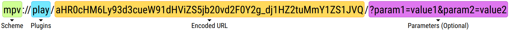

[English][readme-en] | [简体中文][readme-zh-hans] | [繁体中文][readme-zh-hant]

[readme-en]: https://github.com/akiirui/mpv-handler/blob/main/README.md
[readme-zh-hans]: https://github.com/akiirui/mpv-handler/blob/main/README.zh-Hans.md
[readme-zh-hant]: https://github.com/akiirui/mpv-handler/blob/main/README.zh-Hant.md

# mpv handler

一个 **mpv** 的协议处理程序，使用 Rust 编写。

使用 **mpv** 和 **yt-dlp** 播放网站上的视频与音乐。

请配合用户脚本使用：

[![play-with-mpv][badges-play-with-mpv]][greasyfork-play-with-mpv]

## 协议



### 协议名

- `mpv`: 在没有命令行窗口的情况下运行 mpv-handler
- `mpv-debug`: 在有命令行窗口的情况下运行 mpv-handler 以便于查看输出和错误

### 插件 / Plugins

- `play`: 使用 mpv 播放视频

### 编码数据 / Encoded Data

使用 [URL 安全的 base64][rfc-base64-url] 编码网址或标题。

替换 `/` 至 `_`, `+` 至 `-` 并且删除填充的 `=`。

示例 (JavaScript):

```javascript
let data = btoa("https://www.youtube.com/watch?v=Ggkn2f5e-IU");
let safe = data.replace(/\//g, "_").replace(/\+/g, "-").replace(/\=/g, "");
```

### 参数 / Parameters (可选)

```
cookies = [ www.domain.com.txt ]
profile = [ default, low-latency, etc... ]
quality = [ 2160p, 1440p, 1080p, 720p, 480p, 360p ]
v_codec = [ av01, vp9, h265, h264 ]
v_title = [ Encoded Title ]
subfile = [ Encoded URL ]
startat = [ Seconds (float) ]
```

## 安装

### Linux

#### Arch Linux

[![mpv-handler][badges-aur]][download-aur]
[![mpv-handler-git][badges-aur-git]][download-aur-git]

#### 手动安装

1. 下载 [最新的 Linux 压缩包][download-linux]
2. 解压缩压缩包
3. 复制 `mpv-handler` 至 `$HOME/.local/bin`
4. 复制 `mpv-handler.desktop` 至 `$HOME/.local/share/applications/`
5. 复制 `mpv-handler-debug.desktop` 至 `$HOME/.local/share/applications/`
6. 为二进制文件设置可执行权限

   - ```
     $ chmod +x $HOME/.local/bin/mpv-handler
     ```

7. 注册 xdg-mime（感谢 [linuxuprising][linuxuprising] 的提醒）

   - ```
     $ xdg-mime default mpv-handler.desktop x-scheme-handler/mpv
     $ xdg-mime default mpv-handler-debug.desktop x-scheme-handler/mpv-debug
     ```

8. 添加 `$HOME/.local/bin` 到环境变量 `PATH`
9. **可选**: _复制 `config.toml` 至 `$HOME/.config/mpv-handler/config.toml` 并配置_

### Windows

Windows 用户目前只能手动安装。

#### 手动安装

1. 下载 [最新的 Windows 压缩包][download-windows]
2. 解压缩档案到你想要的位置
3. 运行 `handler-install.bat` 注册协议处理程序
4. 编辑 `config.toml` 设置 `mpv` 和 `ytdl` 的路径

## 配置

```toml
mpv = "/usr/bin/mpv"
# 可选，类型：字符串
# mpv 可执行文件的路径
# 默认值:
# - Linux: mpv
# - Windows: mpv.com

ytdl = "/usr/bin/yt-dlp"
# 可选，类型：字符串
# yt-dlp 可执行文件的路径

proxy = "http://example.com:8080"
# 可选，类型：字符串
# HTTP(S) 代理服务器的地址

# 对于 Windows 用户：
#   - 路径格式可以是 "C:\\folder\\some.exe"，也可以是 "C:/folder/some.exe"
#   - 路径的目标是可执行二进制文件，而不是目录
```

[rfc-base64-url]: https://datatracker.ietf.org/doc/html/rfc4648#section-5
[badges-aur-git]: https://img.shields.io/aur/version/mpv-handler-git?style=for-the-badge&logo=archlinux&label=mpv-handler-git
[badges-aur]: https://img.shields.io/aur/version/mpv-handler?style=for-the-badge&logo=archlinux&label=mpv-handler
[badges-play-with-mpv]: https://img.shields.io/greasyfork/v/416271?style=for-the-badge&logo=greasyfork&label=play-with-mpv
[download-aur-git]: https://aur.archlinux.org/packages/mpv-handler-git/
[download-aur]: https://aur.archlinux.org/packages/mpv-handler/
[download-linux]: https://github.com/akiirui/mpv-handler/releases/latest/download/mpv-handler-linux-amd64.zip
[download-macos]: https://github.com/akiirui/mpv-handler/releases/latest/download/mpv-handler-macos-amd64.zip
[download-windows]: https://github.com/akiirui/mpv-handler/releases/latest/download/mpv-handler-windows-amd64.zip
[greasyfork-play-with-mpv]: https://greasyfork.org/scripts/416271-play-with-mpv
[linuxuprising]: https://www.linuxuprising.com/2021/07/open-youtube-and-more-videos-from-your.html
