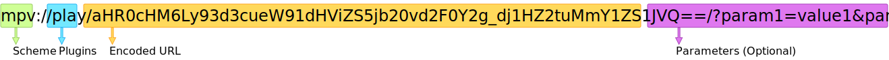

[English][readme-en] | [简体中文][readme-zh-hans] | [繁体中文][readme-zh-hant]

[readme-en]: https://github.com/akiirui/mpv-handler/blob/main/README.md
[readme-zh-hans]: https://github.com/akiirui/mpv-handler/blob/main/README.zh-Hans.md
[readme-zh-hant]: https://github.com/akiirui/mpv-handler/blob/main/README.zh-Hant.md

# mpv handler

一个 **mpv** 的协议处理程序，使用 Rust 编写。

使用 **mpv** 和 **yt-dlp** 播放网站上的视频与音乐。

请配合用户脚本使用：

[![play-with-mpv][badges-play-with-mpv]][greasyfork-play-with-mpv]

## 协议



### 插件 / Plugins

- `play`: 使用 mpv 播放视频

### 编码的视频网址 / Encoded Video URL

使用 [URL 安全的 base64][wiki-url-base64] 编码视频网址。

示例 (JavaScript):

```javascript
let data = btoa("https://www.youtube.com/watch?v=Ggkn2f5e-IU");
let safe = data.replace(/\//g, "_").replace(/\+/g, "-");
```

### 参数 / Parameters (可选)

```
cookies = [ www.domain.com.txt ]
profile = [ default, low-latency, etc... ]
quality = [ best, 2160p, 1440p, 1080p, 720p, 480p, 360p ]
v_codec = [ av01, vp9, h265, h264 ]
```

## 安装

### Linux

- Arch Linux

  [![mpv-handler][badges-aur]][download-aur] \
  [![mpv-handler-git][badges-aur-git]][download-aur-git]

#### 手动安装

1. 下载 [最新的 Linux 压缩包][download-linux]
2. 解压缩压缩包
3. 复制 `mpv-handler` 至 `$HOME/.local/bin`
4. 复制 `mpv-handler.desktop` 至 `$HOME/.local/share/applications/`
5. 为二进制文件设置可执行权限

```
$ chmod +x $HOME/.local/bin/mpv-handler
```

6. 注册 xdg-mime（感谢 [linuxuprising][linuxuprising] 的提醒）

```
$ xdg-mime default mpv-handler.desktop x-scheme-handler/mpv
```

6. 如果需要，添加 `$HOME/.local/bin` 到环境变量 `PATH`
7. 如果需要，创建 `$HOME/.config/mpv-handler/custom.toml` 并按需更改

### Windows

Windows 用户目前只能手动安装。

#### 手动安装

1. 下载 [最新的 Windows 压缩包][download-windows]
2. 解压缩档案到你想要的位置
3. 运行 `handler-install.bat` 注册协议处理程序
4. 如果需要，添加 **mpv** 和 **yt-dlp** 到环境变量 `PATH`
5. 如果需要，更改 `config.toml`

### macOS (Alpha)

**我没有测试过它，如果它不工作，请通过 issue 反馈。**

macOS 用户目前只能手动安装。

#### 手动安装

1. 下载 [最新的 macOS 压缩包][download-macos]
2. 解压缩档案并复制 `mpv-handler.app` 文件夹到 `$HOME/Applications`
3. 如果需要，添加 **mpv** 和 **yt-dlp** 到环境变量 `PATH`
4. 如果需要，创建 `$HOME/Library/Application Support/mpv-handler/config.toml` 并按需更改

## 配置

如果您已经把 **mpv** 和 **yt-dlp** 添加到了 `PATH`，通常来说不需要手动配置。

```toml
mpv = "/usr/bin/mpv"

# 可选，类型：字符串
# mpv 可执行文件的路径
# 默认值:
# - Linux: mpv
# - Windows: mpv.com

ytdl = "/usr/bin/yt-dlp"

# 可选，类型：字符串
# youtube-dl 可执行文件的路径
# 默认值:
# - Linux: yt-dlp
# - Windows: yt-dlp.exe

# 对于 Windows 用户：
#   路径格式可以是 "C:\\folder\\some.exe"，也可以是 "C:/folder/some.exe"
```

[wiki-url-base64]: https://en.wikipedia.org/wiki/Base64#URL_applications
[badges-aur-git]: https://img.shields.io/aur/version/mpv-handler-git?label=mpv-handler-git&style=for-the-badge
[badges-aur]: https://img.shields.io/aur/version/mpv-handler?label=mpv-handler&style=for-the-badge
[badges-play-with-mpv]: https://img.shields.io/badge/dynamic/json?style=for-the-badge&label=play-with-mpv&prefix=v&query=version&url=https%3A%2F%2Fgreasyfork.org%2Fscripts%2F416271.json
[download-aur-git]: https://aur.archlinux.org/packages/mpv-handler-git/
[download-aur]: https://aur.archlinux.org/packages/mpv-handler/
[download-linux]: https://github.com/akiirui/mpv-handler/releases/latest/download/mpv-handler-linux-amd64.zip
[download-macos]: https://github.com/akiirui/mpv-handler/releases/latest/download/mpv-handler-macos-amd64.zip
[download-windows]: https://github.com/akiirui/mpv-handler/releases/latest/download/mpv-handler-windows-amd64.zip
[greasyfork-play-with-mpv]: https://greasyfork.org/scripts/416271-play-with-mpv
[linuxuprising]: https://www.linuxuprising.com/2021/07/open-youtube-and-more-videos-from-your.html
